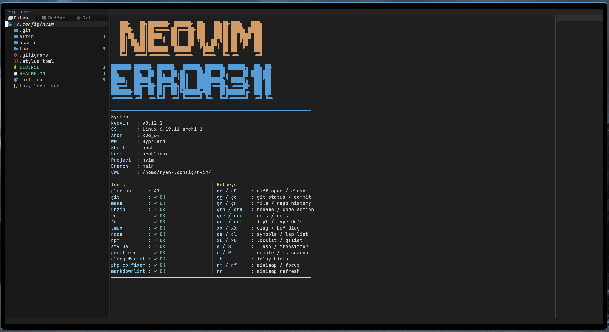
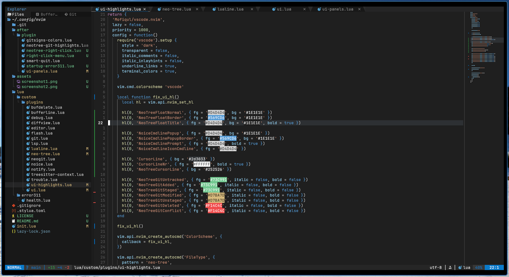

# error311-nvim

My personal Neovim config focused on a clean VS Code-like look with strong file management, Git workflow, debugging, minimap, startup dashboard, and quality-of-life UI tweaks.

## Highlights

- Custom startup screen with system/tools/hotkeys info
- Neo-tree with improved right-click actions
- neominimap integration
- Lualine macro recording status
- Telescope + modern UI polish
- Debugging and formatting shortcuts

## Notes

This is my personal config, but feel free to borrow ideas or use parts of it.

## Screenshot

### Startup Dashboard

### Workspace

